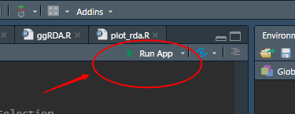

# rdaWithStep
A shiny app to perform RDA with variable selection and create awesome figures and tables.

rdaWithStep is hosted at [Shinyapps.io](https://hanchen.shinyapps.io/rdaWithStep/).

## What is RDA with step selection?

Briefly, the Monte Carlo permutation tests followed by backward, forward or bothward selection were used to determine which variable was contained in each variable set.

As [vegan::ordistep](https://www.rdocumentation.org/packages/vegan/versions/2.4-2/topics/ordistep) described:

> The basic functions for model choice in constrained ordination are add1.cca and drop1.cca. With these functions, ordination models can be chosen with standard R function step which bases the term choice on AIC. AIC-like statistics for ordination are provided by functions deviance.cca and extractAIC.cca (with similar functions for rda). Actually, constrained ordination methods do not have AIC, and therefore the step may not be trusted. This function provides an alternative using permutation P-values.

> Function ordistep defines the model, scope of models considered, and direction of the procedure similarly as step. The function alternates with drop and add steps and stops when the model was not changed during one step. The - and + signs in the summary table indicate which stage is performed. It is often sensible to have Pout > Pin in stepwise models to avoid cyclic adds and drops of single terms

## Focus on species or sample site?

In general, there are two main scopes of RDA:

  1. determine the relationships of species and environment variables only;
  2. except determine the relationships of species and environment variables, the simple sites were also considered.
  
In this case, adding sample sites in the figure is not in my plan yet.

However, you are welcomed to commit any feature about this and even any other features in my [repo on GitHub](https://github.com/womeimingzi11/rdaWithStep).

You are also welcomed to visit my [Blog (in Chinese)](https://womeimingzi11.github.io) or contact me by [mail](mailto://chenhan28@gmail.com).

## How to use it?

### 1. EZ way

[Click here](https://hanchen.shinyapps.io/rdaWithStep/). rdaWithStep is hosted at [Shinyapps.io](https://Shinyapps.io).

### 2. Hardcore way
To make sure that you can control everything, you are welcomed to [fork my code](https://github.com/womeimingzi11/rdaWithStep/fork) to your own repo (and leave me a star please).

Then what you can do is to open `rdaWithStep.Rproj` file in RStudio, following open `app.R` file, install all the packages which will be loaded.

### Required Packages

The following packages are required to run rdaWithStep:

* **Shiny packages**: shiny, shinythemes, DT
* **Data manipulation**: tidyverse, vegan
* **Visualization**: ggvegan (will be automatically installed if missing)

You can install these packages with:

```r
# Install CRAN packages
install.packages(c("shiny", "shinythemes", "DT", "tidyverse", "vegan"))

# Install ggvegan from GitHub
if (!requireNamespace("remotes", quietly = TRUE)) install.packages("remotes")
remotes::install_github("gavinsimpson/ggvegan")
```

At the least, click `Run App` at the right top of the code editor panel, **rdaWithStep** will run locally.




## Example Data

The application provides two demonstration datasets:

### Iris Dataset

* The iris dataset is a well-known multivariate dataset that contains measurements for 150 iris flowers from three different species (setosa, versicolor, and virginica).
* For RDA analysis, we use the flower measurements (Sepal.Length, Sepal.Width, Petal.Length, Petal.Width) as species data.
* The species information (setosa, versicolor, virginica) is converted to binary variables and used as environmental variables.

This dataset is directly accessible in R without needing to load external files, making it an ideal example for demonstrating RDA analysis. When you select "Try the iris demo" in the application, the iris dataset will be automatically loaded.

### Original Example Dataset

The original example dataset is stored in CSV files in the `resource/data` directory:

* `df_com_smp.csv`: Contains species data
* `df_env_smp.csv`: Contains environmental variables

When you select "Try the original demo" in the application, these files will be automatically loaded.

## Features
- [x] Reveal Input Matrices
- [x] Perform RDA
  - [x] RDA without Selection
  - [x] RDA with Selection
- [x] Variable Significance
  - [x] Monte Carlo permutation test
  - [x] Significance Table
- [x] RDA plot
- [x] Export results as tables and figures

## Known Issues
If you encounter any issues, please report them in the [GitHub Issues](https://github.com/womeimingzi11/rdaWithStep/issues) section.

## Privacy Statements
We guarantee that all your data won't be kept once you leave the Shiny app. There is no code and won't have any code to record your clientID, uploaded files or any other data.